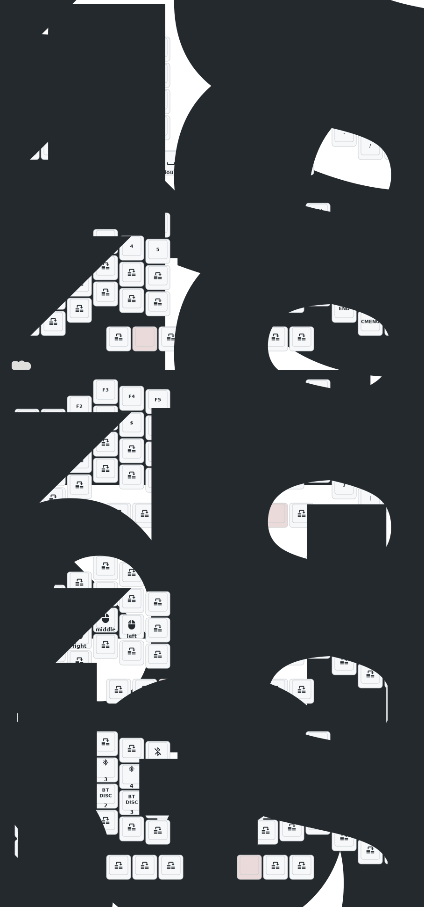

# zmk-for-crosses46-dual

## This template is only compatible with the wireless Crosses46 keyboard whose PCB I have modified, not with the original pins.

### Default Firmware Keymap

## Local builds

- Uses `.zmk-workspace/` as the local west workspace.
- Syncs `config/` into `.zmk-workspace/config/` before each build.
- Builds entries from `build.yaml` and copies `.uf2` files into `dist/`.
- Reads the artifact matrix from `build.yaml`.

### Python requirements

- Install the pinned Python packages into the local pyenv environment:
  - `~/.pyenv/versions/zmk-for-crosses46-dual/bin/python -m pip install -r requirements.txt`

### Build everything

- `./scripts/build-local.sh`

### Build selected artifacts

- `./scripts/build-local.sh crosses_54_left crosses_54_right`

### Build with USB logging enabled

- `./scripts/build-local.sh --logging crosses_54_left`

### See available artifact names

- `./scripts/build-local.sh --list`

### Update the west workspace

- `./scripts/build-local.sh update`
- If west-managed projects inside `.zmk-workspace/` have local modifications, the script refuses to update until those changes are stashed, reverted, or the workspace is purged.

### Keyboard Layers App Companion

- This repo supports the Keyboard Layers App Companion layer-status module on the central/right half.
- After pulling these changes, run `./scripts/build-local.sh update` once so west fetches `zmk-feature-appcompanion`.
- The right-side build enables both BLE HID embedded layer status and USB raw HID layer status, matching the reference setup.

### Clean local outputs

- `./scripts/build-local.sh clean`

### Remove the local workspace entirely

- `./scripts/build-local.sh purge`
